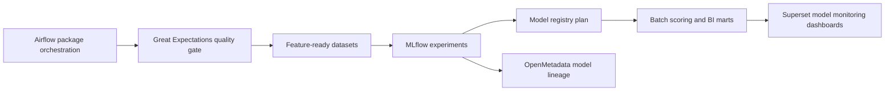

# Architecture

## Platform Role

This repository manages the ML lifecycle layer for NordForge. It does not replace Airflow, Great Expectations, OpenMetadata, or Superset. It complements them:

- Airflow schedules training and scoring jobs.
- Great Expectations validates source packages and feature inputs.
- MLflow tracks experiments, metrics, artifacts, and model candidates.
- OpenMetadata documents lineage, ownership, and certification status.
- Superset monitors model outcomes and business impact.

## Local MLflow

`docker-compose.yaml` starts a local MLflow tracking server on port 5000 using SQLite metadata and local artifacts. This is appropriate for portfolio demos and local development.

For production, use a database-backed tracking store and managed artifact storage.

## Model Lifecycle States

| State | Meaning |
| --- | --- |
| `candidate` | Model has source data, metric gates, and can run baseline experiments |
| `staging` | Candidate is approved for shadow or limited business review |
| `production` | Model is approved for operational scoring |
| `data_gap` | Business use case exists, but source data products are not available yet |
| `retired` | Model is no longer active |

## Current Portfolio Boundary

Supplier-risk and energy-anomaly models are included as data gaps because the current NordForge generated packages do not yet include supplier delivery history or energy meter telemetry.
